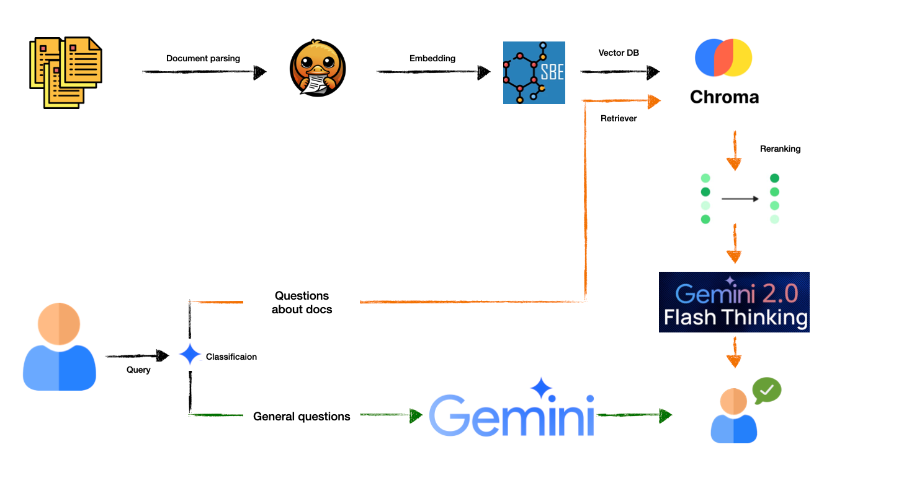

# AskMyDocs - RAG System

A Retrieval-Augmented Generation (RAG) system that allows you to ask questions about your documents and get AI-powered responses.

## Project Architecture



## Features

- Document processing and vectorization
- Intelligent query analysis
- Context-aware response generation
- Support for PDF documents
- Korean language support
- Modular and extensible architecture

## Project Structure

```
.
├── rag/
│   ├── __init__.py
│   ├── main.py              # Main entry point and RAGSystem class
│   ├── config/
│   │   ├── constants.py     # Configuration constants
│   │   └── prompts.py       # Prompt templates
│   ├── document_processor.py # Document loading and processing
│   ├── llm_chain.py         # LLM chain functionality
│   └── rag_graph.py         # RAG workflow graph
├── data/                    # Directory for PDF documents
├── chroma_db/              # Vector store directory
├── requirements.txt        # Project dependencies
└── README.md              # This file
```

## Installation

1. Clone the repository
```bash
git clone https://github.com/yourusername/AskMyDocs.git
cd AskMyDocs
```

2. Create and activate a virtual environment(Optional)
```bash
python -m venv .venv
source .venv/bin/activate  # On Windows: .venv\Scripts\activate
```

3. Install dependencies
```bash
pip install -r requirements.txt
```

4. Set up environment variables:
Create a `.env` file in the project root with:
```
GEMINI_API_KEY=your_api_key_here
GEMINI_MODEL_NAME=gemini-2.0-flash-001
SYSTEM_TITLE=main page title
INITIAL_MESSAGE:assistant initail message
DOCUMENT_DOMAIN:your docs domain
```

## Usage

1. Place your PDF documents in the `data/` directory.

2. Use the RAG system in your code:
```python
from rag import RAGSystem

# Initialize the system
rag = RAGSystem()

# Process a query
result = rag.process_query("What are the main concepts?")
print(result["answer"])
```

3. Or run the example script:
```bash
python -m run.py

## Configuration

The system can be configured through:

1. Environment variables in `.env`
2. Constants in `rag/config/constants.py`
3. Prompts in `rag/config/prompts.py`
````
